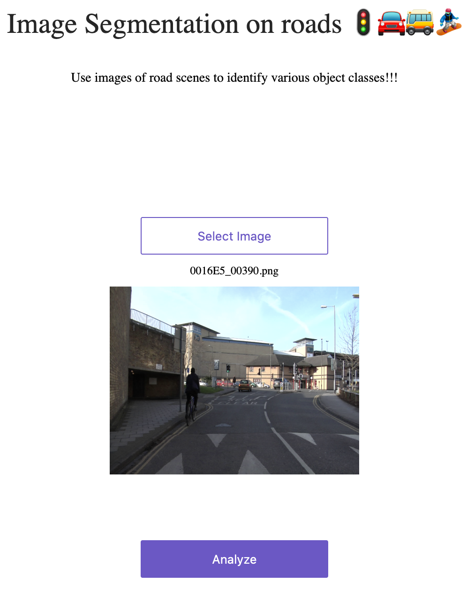
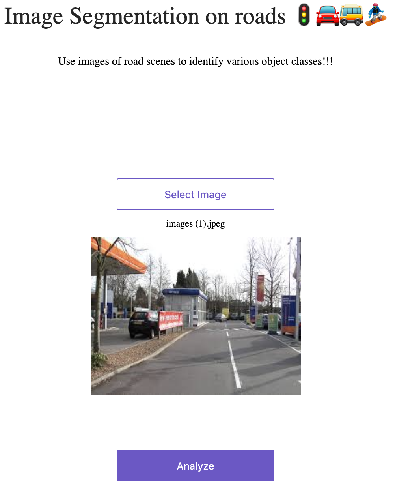
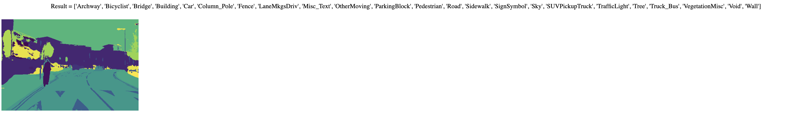

# Image Segmentation with Fastai
 Image segmentation code & app with fastai
 
 1. The Collab notebook gives the training code 
 2. Results from app deployed on local are shown below
 
 ### Results:
 
 | 

#### Analyzed result 1:
 

#### Analyzed result 2:
 

 
 
